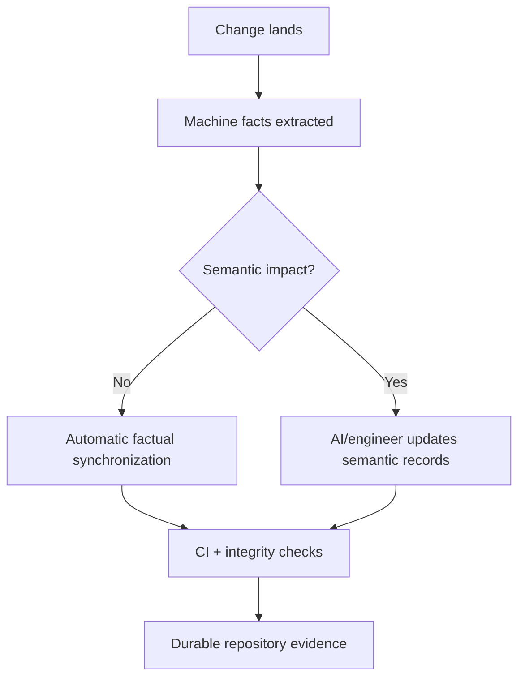
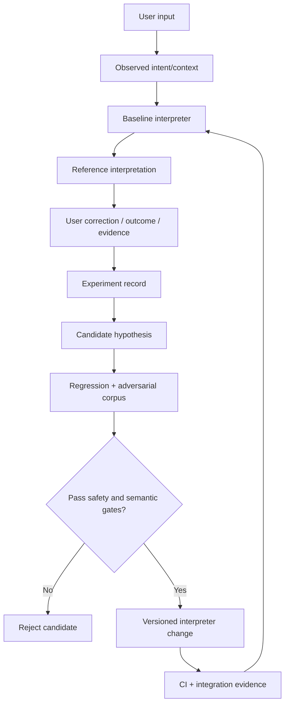

# DevOS Living State & Evolution Contract

> Normative maintenance contract for keeping DevOS understandable and continuable by a fresh AI, account, model, host, or platform.

## Purpose

DevOS is a living engineering system. Its implementation, architecture, evidence, and roadmap must remain recoverable from the repository rather than from one conversation or AI account.

This contract defines how implementation changes become durable project knowledge and how the Human Language Interpreter can improve through controlled experiments without gaining authority from those experiments.

## Source-of-truth precedence

```text
1. Current source tree + Git
2. Explicit requirements / approved decisions
3. .ai/CURRENT-STATE.md + .ai/TASKS.md + semantic .ai records
4. .ai/SESSIONS/ provenance
5. Generated indexes / machine summaries
6. Chat / model memory
```

Chat memory may help recover intent, but it cannot override repository evidence.

## Material-change closure

A material engineering change is complete only when all applicable parts exist:

```text
IMPLEMENTED + VERIFIED + DOCUMENTED + DURABLE STATE
```

The durable state should normally include the smallest affected set of `.ai/CURRENT-STATE.md`, `.ai/TASKS.md`, `.ai/DECISIONS.md`, `.ai/SESSIONS/`, `.ai/CHANGELOG.md`, and affected architecture/contracts/docs.

## Automatic vs semantic documentation

Automation is encouraged, but the system must separate facts from interpretation.

Automation may safely derive Git HEAD/changed files, CI identifiers/outcomes, timestamps, generated indexes, factual diff summaries, health diagnostics, and evidence packet references.

Human/AI semantic work must decide whether architecture changed, why a decision changed, whether an objective is complete, what a new behavior means, future product goals, security/authorization implications, and experiment conclusions. A workflow must not convert an unverified commit-message interpretation into semantic truth.

## Automatic synchronization principle



Semantic impact includes architecture, contracts, authorization, recovery, project identity, human-language interpretation, runtime behavior, evidence policy, or future roadmap changes.

## Human Language Interpreter evolution

P15 is allowed to evolve, but language improvement is constrained by a permanent semantic boundary:

> **Better interpretation may change what the user means; it must never change what the user is authorized to do.**



Persistent P15 experiments should record experiment ID, source head, input/context, baseline and candidate interpretation, semantic delta, false-positive/false-negative hypotheses, security/authorization review, regression cases, observed result, and `ADOPT | REJECT | DEFER` decision.

The interpreter must never infer from language that `continue`, urgency, prior approval, provider credentials, “full approval”, model identity, or a previous successful run automatically broadens authority.

## Multi-project isolation

A long-running agent may operate on multiple repositories, but semantic and authorization state remain project-scoped:

```text
Project A state != Project B state
Project A approval != Project B approval
Project A provider binding != Project B provider binding
```

## Evidence rule

Every living-documentation claim should be classifiable as:

```text
OBSERVED | DETERMINISTIC | HISTORICAL | INFERRED | UNKNOWN
```

`UNKNOWN` must never be promoted to `PASS` merely to keep documentation attractive.

## Roadmap maintenance

Update the master engineering map when there is a material architecture boundary change, new verified capability, retired/replaced component, new evidence boundary, new interpreter capability, new host/provider adapter contract, material security/authorization semantic change, portability milestone, or major future-goal reprioritization.

Small fixes normally update only affected `.ai` and component records.

## Closure invariant

Before a material objective is declared complete, the repository should make recoverable:

```text
WHAT changed?
WHY?
WHERE is it?
HOW was it verified?
WHAT proves it?
WHAT remains unproven?
WHAT durable records changed?
WHAT should the next AI do?
```

## Future automation target

```text
Push / PR
  ↓
Changed-scope classifier
  ↓
Machine fact extraction
  ↓
Semantic-impact detection
  ↓
Required-record checklist
  ↓
AI/engineer semantic update
  ↓
Integrity verifier
  ↓
CI evidence
  ↓
Merge
  ↓
Fresh-AI recoverability
```

The classifier can be automated. Semantic conclusions still require bounded evidence and review. The system should make missing documentation difficult to overlook without fabricating documentation.

## Compatibility target

```text
Host UX / Model
      ↓
Host adapter
      ↓
DevOS semantic + governance core
      ↓
Project repository + .ai
      ↓
Provider / tool adapters
      ↓
External systems
```

## Non-negotiable safety boundary

```text
LEARNING != AUTHORIZATION
DOCUMENTATION != AUTHORIZATION
CI PASS != AUTHORIZATION
MEMORY != AUTHORIZATION
CREDENTIAL != AUTHORIZATION
```

That separation is the foundation that allows DevOS to become more capable without becoming uncontrolled.
