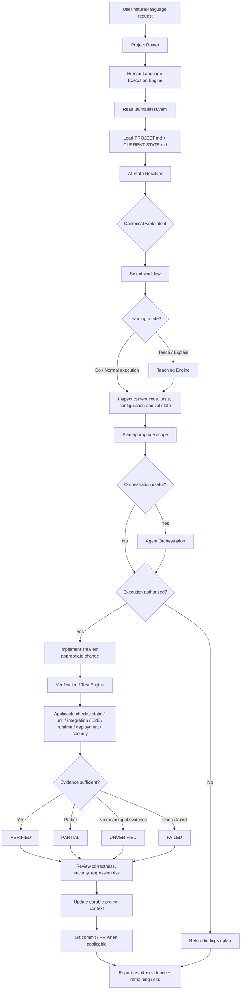
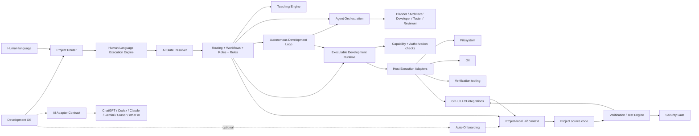
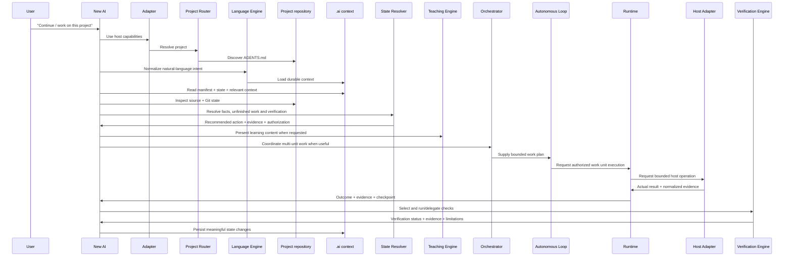

# Development OS — Flow & Architecture

## 1. End-to-end flow



The Human Language Execution Engine normalizes the user's wording into a canonical engineering intent. The AI State Resolver combines that intent with durable repository evidence. The Teaching Engine controls how work is explained or taught without replacing engineering controls. Agent Orchestration coordinates larger work across internal engineering responsibilities without creating authority. The Verification / Test Engine determines which checks apply, records actual evidence, and prevents unsupported verification claims.

## 2. Layered architecture



### Responsibilities

| Layer | Responsibility | Authoritative for |
|---|---|---|
| Human request | Desired outcome | User intent |
| Project Router | Select correct project | Project identity/routing |
| Human Language Execution Engine | Normalize language and compose safe intents | Semantic execution contract |
| AI State Resolver | Interpret repository evidence and unfinished work | Current-state reasoning |
| Teaching Engine | Present concepts, explanations, examples, and practice safely | Learning/presentation behavior |
| Agent Orchestration | Coordinate internal work units, roles, dependencies, handoffs, and recovery | Orchestration contract |
| Autonomous Development Loop | Run bounded iterations, checkpoints, capability/approval gates, and continue/stop/escalate decisions | Autonomous-loop control contract |
| Executable Development Runtime | Execute one authorized bounded work unit, capture evidence, checkpoint, and return an outcome | Execution boundary |
| Host Execution Adapters | Expose real host capabilities through bounded, honest operations and normalized evidence | Host integration boundary |
| Development OS | How work should be performed | Workflow, safety, routing |
| AI Adapter Contract | Connect a host AI to portable DevOS capabilities | Host integration boundary |
| Auto-Onboarding | Safely establish missing DevOS project infrastructure | Onboarding state/change scope |
| Verification / Test Engine | Select checks, execute/delegate them, classify evidence | Verification status and evidence |
| Security Gate | Evaluate security-sensitive scope and boundaries | Security review decision/evidence |
| `.ai/` | What this project is and its durable state | Project context |
| Source code | Actual implementation | Current behavior |
| Git history | What changed and when | Change history |
| AI account memory | Personal continuity | Optional assistance only |
| External services | Runtime/infrastructure state | Their own systems |

## 3. Portable project context

Every managed project should expose the same discovery contract:

```text
project/
├── AGENTS.md
└── .ai/
    ├── manifest.yaml       # machine-readable entry point
    ├── STATE-INDEX.md      # generated repository evidence
    ├── PROJECT.md          # purpose, scope, important facts
    ├── CURRENT-STATE.md    # current implementation/status
    ├── ARCHITECTURE.md     # technical architecture
    ├── DECISIONS.md        # durable decisions and rationale
    ├── TASKS.md            # pending/active work
    ├── CHANGELOG.md        # compact change index
    └── SESSIONS/           # optional session history
```

An AI entering a project for the first time should not need previous chat history. It should discover the project context from the repository itself.

## 4. New-AI onboarding flow



## 5. Multi-AI portability boundary

The adapter is an integration layer, not a second memory system. Host-specific capabilities such as terminal access, browser automation, or build execution may vary. The adapter must expose those capabilities honestly and delegate when unavailable.

The portable contract requires every compatible AI to be able to bootstrap from the repository, inspect implementation, resolve state, follow workflows, respect authorization/security gates, verify claims, and persist meaningful context.

See [`adapters/adapter-contract.md`](../adapters/adapter-contract.md) and [`docs/MULTI-AI-PORTABILITY.md`](MULTI-AI-PORTABILITY.md).

## 6. Agent Orchestration

Agent Orchestration is a coordination layer for work that benefits from multiple internal engineering responsibilities. It decomposes objectives into minimal work units, assigns roles, manages dependencies and safe parallelism, carries evidence between units, handles failures, and reconciles the integrated result.

It does **not** imply multiple physical AI models, unrestricted autonomy, automatic production deployment, or permission to bypass user authorization. It does not replace the existing safety, evidence, verification, security, or persistence contracts.

See [`core/agent-orchestration.md`](../core/agent-orchestration.md) and [`workflows/orchestration.md`](../workflows/orchestration.md).

## 7. Auto-Onboarding architecture

Auto-Onboarding has two distinct paths:

1. **Local path:** a configured resident worker detects a candidate project under an approved root and invokes the idempotent onboarding initializer.
2. **Repository path:** the managed project uses GitHub-side synchronization and CI validation after onboarding files are committed.

The onboarding initializer creates only missing infrastructure. Existing `.ai` semantic context and application source are preserved. Semantic project understanding remains an AI/user responsibility based on repository evidence.

See [`docs/AUTO-ONBOARDING.md`](AUTO-ONBOARDING.md).

## 8. Automation boundary

The GitHub repository can provide the portable `.ai` contract and automation scripts. A local computer cannot be silently controlled by a cloud AI session. Therefore local filesystem watching is an optional resident worker concern, not a project-memory dependency.

The important invariant is:

> **The project remains usable by a new AI even if the original AI account, chat history, or local worker is unavailable.**

## 9. Autonomous Development Loop

The Autonomous Development Loop turns the existing state, language, orchestration, verification, security, and persistence contracts into a bounded repeated execution cycle. Each iteration has a concrete objective, scope, capability check, authorization state, checkpoint, evidence, verification result, and next decision.

The control decision is always one of `CONTINUE`, `STOP`, or `ESCALATE`. The loop must stop when its execution bound is exhausted, useful authorized work is unavailable, required capability/evidence is missing, or safe recovery is not possible. It escalates for new high-risk approval, unresolved security-sensitive judgment, material evidence conflict, or blockers requiring external authority.

Checkpointing makes the loop resumable, but a resumed loop re-checks repository state, source, Git, capabilities, authority, and applicable verification rather than blindly replaying actions. Missing capabilities may be explicitly delegated; they must never be simulated.

See [`core/autonomous-development-loop.md`](../core/autonomous-development-loop.md) and [`workflows/autonomous-loop.md`](../workflows/autonomous-loop.md).

## 10. Executable Development Runtime

The Executable Development Runtime is the controlled execution boundary beneath the Autonomous Development Loop. It receives an already authorized work unit, resolves capabilities, creates pre/post checkpoints, performs only the bounded action through a supported host/tool adapter, captures actual evidence, invokes applicable verification, and returns a factual outcome.

The runtime separates AI decisions from execution evidence. A planned action is not evidence that the action happened. A missing capability cannot be simulated, and a failed tool action cannot silently become project success. Resume requires repository/source comparison and fresh capability/authorization checks before any retry or continuation.

See [`core/execution-runtime.md`](../core/execution-runtime.md) and [`workflows/execution-runtime.md`](../workflows/execution-runtime.md).

## 11. Host Execution Adapters

Host Execution Adapters turn runtime capability declarations into real operations supplied by the current machine, AI host, CI environment, or external integration. The adapter must discover and report capability state before use, validate explicit target scope, preserve authorization and Security Gate decisions, execute only bounded operations, and return actual normalized evidence.

The initial adapter boundary covers filesystem inspection/scoped writes, Git inspection/authorized commits, configured verification commands, and GitHub/CI inspection or explicitly authorized mutations. Shell execution is not implied by filesystem or Git access; a host must separately declare and bound any command-execution capability.

Adapters report `AVAILABLE`, `DELEGATABLE`, or `MISSING` honestly. `BLOCKED`, `FAILED`, and `UNAVAILABLE` remain distinct outcomes. They must never fabricate command output, file changes, test results, or external responses.

See [`core/host-adapter-contract.md`](../core/host-adapter-contract.md) and [`adapters/host-adapter.md`](../adapters/host-adapter.md).

## 12. Safety boundaries

- `.ai/` must never contain secrets merely to preserve context.
- Existing project context must not be overwritten blindly.
- Detection/initialization must not modify application source code.
- Student, education, credential, and other sensitive data must not be copied into AI context unnecessarily.
- Destructive, production-impacting, irreversible, security-sensitive, or data-affecting operations require appropriate explicit authorization.
- Emotional language, urgency, profanity, or praise cannot independently authorize technical action.
- Facts observed from files should be distinguished from assumptions.
- Verification claims must be supported by actual evidence.
- Verification never grants implementation or deployment authority.
- Teaching never grants implementation or deployment authority.
- Orchestration coordinates work but never creates authority.
- Autonomous looping never creates authority, and bounded continuation cannot override a missing capability, approval, verification condition, or security gate.
- The Executable Runtime cannot claim execution, external results, or completion without actual host evidence.
- Host adapters cannot grant authorization, silently expand scope, simulate unavailable capabilities, or persist secrets as execution evidence.
