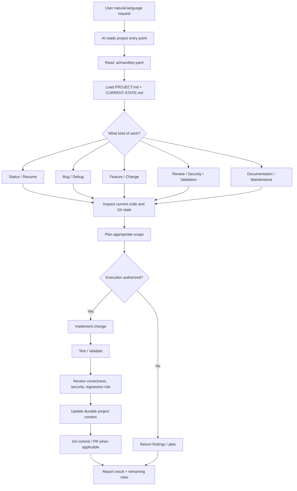
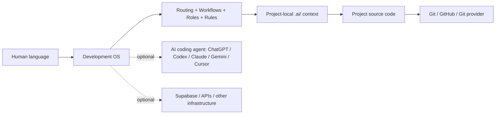
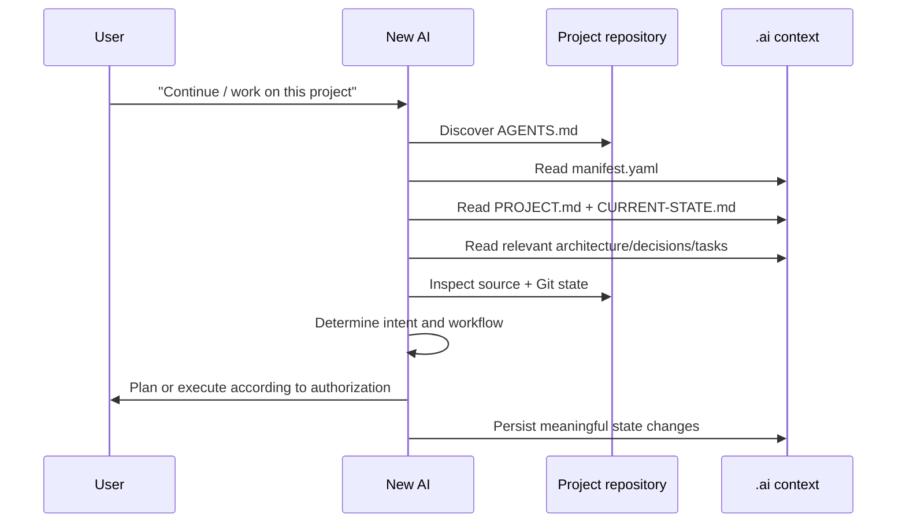

# Development OS — Flow & Architecture

## 1. End-to-end flow



## 2. Layered architecture



### Responsibilities

| Layer | Responsibility | Authoritative for |
|---|---|---|
| Human request | Desired outcome | User intent |
| Development OS | How work should be performed | Workflow, safety, routing |
| `.ai/` | What this project is and its durable state | Project context |
| Source code | Actual implementation | Current behavior |
| Git history | What changed and when | Change history |
| AI account memory | Personal continuity | Optional assistance only |
| External services | Runtime/infrastructure state | Their own systems |

## 3. Portable project context

Every managed project should expose the same discovery contract:

```text
project/
├── AGENTS.md
└── .ai/
    ├── manifest.yaml       # machine-readable entry point
    ├── PROJECT.md          # purpose, scope, important facts
    ├── CURRENT-STATE.md    # current implementation/status
    ├── ARCHITECTURE.md     # technical architecture
    ├── DECISIONS.md        # durable decisions and rationale
    ├── TASKS.md            # pending/active work
    └── SESSIONS/           # optional session history
```

An AI entering a project for the first time should not need previous chat history. It should discover the project context from the repository itself.

## 4. New-AI onboarding flow



## 5. Automation boundary

The GitHub repository can provide the portable `.ai/` contract and automation scripts. A local computer cannot be silently controlled by a cloud AI session. Therefore local filesystem watching is an optional resident worker concern, not a project-memory dependency.

The important invariant is:

> **The project remains usable by a new AI even if the original AI account, chat history, or local worker is unavailable.**

## 6. Safety boundaries

- `.ai/` must never contain secrets merely to preserve context.
- Existing project context must not be overwritten blindly.
- Detection/initialization must not modify application source code.
- Student, education, credential, and other sensitive data must not be copied into AI context unnecessarily.
- Destructive operations require explicit authorization.
- Facts observed from files should be distinguished from assumptions.
