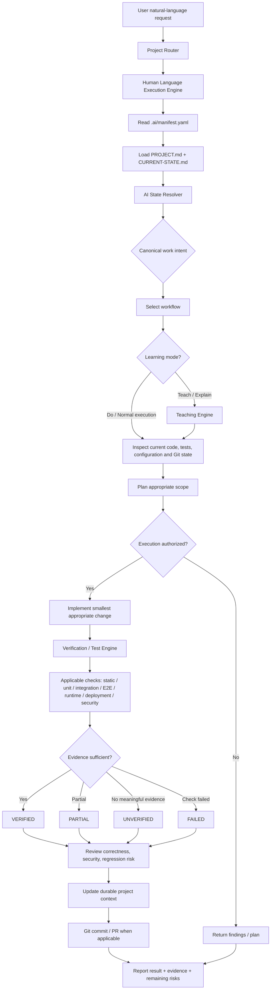
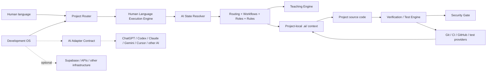
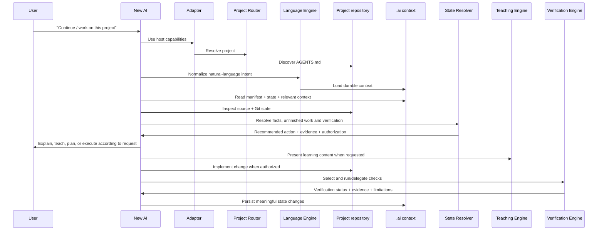

# Development OS — Flow & Architecture

## 1. End-to-end flow



The Human Language Execution Engine normalizes the user's wording into a canonical engineering intent. The AI State Resolver combines that intent with durable repository evidence. The Teaching Engine controls how work is explained or taught without replacing engineering controls. The Verification / Test Engine determines which checks apply, records actual evidence, and prevents unsupported verification claims.

## 2. Layered architecture



### Responsibilities

| Layer | Responsibility | Authoritative for |
|---|---|---|
| Human request | Desired outcome | User intent |
| Project Router | Select correct project | Project identity/routing |
| Human Language Execution Engine | Normalize language and compose safe intents | Semantic execution contract |
| AI State Resolver | Interpret repository evidence and unfinished work | Current-state reasoning |
| Teaching Engine | Present concepts, explanations, examples, and practice safely | Learning/presentation behavior |
| Development OS | How work should be performed | Workflow, safety, routing |
| AI Adapter Contract | Connect a host AI to portable DevOS capabilities | Host integration boundary |
| Verification / Test Engine | Select checks, execute/delegate them, classify evidence | Verification status and evidence |
| Security Gate | Evaluate security-sensitive scope and boundaries | Security review decision/evidence |
| `.ai/` | What this project is and its durable state | Project context |
| Source code | Actual implementation | Current behavior |
| Git history | What changed and when | Change history |
| AI account memory | Personal continuity | Optional assistance only |
| External services | Runtime/infrastructure state | Their own systems |

## 3. Portable project context

Every managed project should expose the same discovery contract:

```text
project/
├── AGENTS.md
└── .ai/
    ├── manifest.yaml       # machine-readable entry point
    ├── STATE-INDEX.md      # generated repository evidence
    ├── PROJECT.md          # purpose, scope, important facts
    ├── CURRENT-STATE.md    # current implementation/status
    ├── ARCHITECTURE.md     # technical architecture
    ├── DECISIONS.md        # durable decisions and rationale
    ├── TASKS.md            # pending/active work
    ├── CHANGELOG.md        # compact change index
    └── SESSIONS/           # optional session history
```

An AI entering a project for the first time should not need previous chat history. It should discover the project context from the repository itself.

## 4. New-AI onboarding flow



## 5. Multi-AI portability boundary

The adapter is an integration layer, not a second memory system. Host-specific capabilities such as terminal access, browser automation, or build execution may vary. The adapter must expose those capabilities honestly and delegate when unavailable.

The portable contract requires every compatible AI to be able to bootstrap from the repository, inspect implementation, resolve state, follow workflows, respect authorization/security gates, verify claims, and persist meaningful context.

See [`adapters/adapter-contract.md`](../adapters/adapter-contract.md) and [`docs/MULTI-AI-PORTABILITY.md`](MULTI-AI-PORTABILITY.md).

## 6. Automation boundary

The GitHub repository can provide the portable `.ai/` contract and automation scripts. A local computer cannot be silently controlled by a cloud AI session. Therefore local filesystem watching is an optional resident worker concern, not a project-memory dependency.

The important invariant is:

> **The project remains usable by a new AI even if the original AI account, chat history, or local worker is unavailable.**

## 7. Safety boundaries

- `.ai/` must never contain secrets merely to preserve context.
- Existing project context must not be overwritten blindly.
- Detection/initialization must not modify application source code.
- Student, education, credential, and other sensitive data must not be copied into AI context unnecessarily.
- Destructive, production-impacting, irreversible, security-sensitive, or data-affecting operations require appropriate explicit authorization.
- Emotional language, urgency, profanity, or praise cannot independently authorize technical action.
- Facts observed from files should be distinguished from assumptions.
- Verification claims must be supported by actual evidence.
- Verification never grants implementation or deployment authority.
- Teaching never grants implementation or deployment authority.
