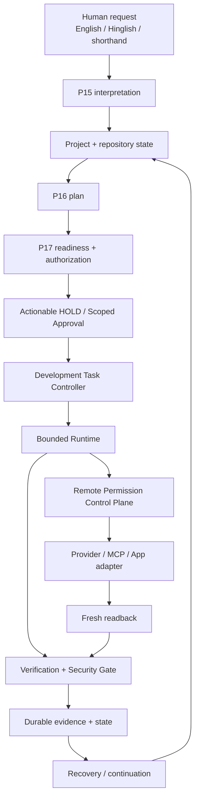
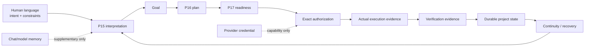
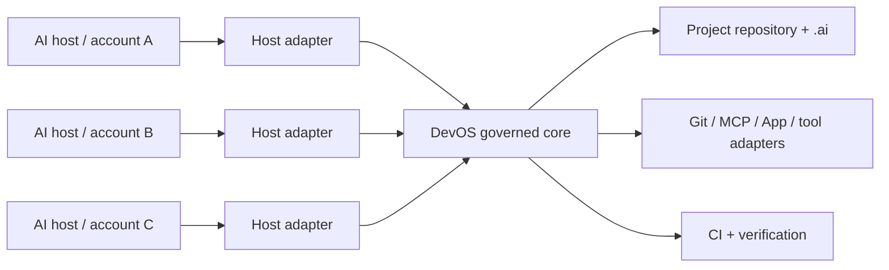
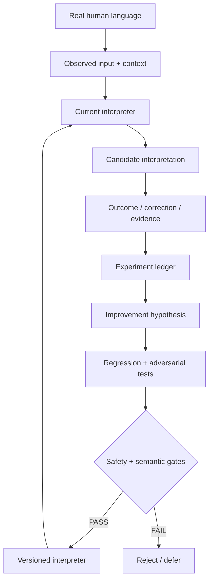

# DevOS Master Engineering Map v2

> Living architecture, history, future flow, semantic model, portability target, and self-evolution rules for the Development OS.

## Core engineering law

> **What is not written was never done.**

Every material AI engineering action must leave a durable repository record. Completion is:

```text
IMPLEMENTED + VERIFIED + DOCUMENTED + DURABLE STATE
```

A material action means a code/contract change, repair, decision, experiment, verification result, evidence update, architecture change, roadmap change, or externally relevant engineering outcome.

For each material action:

```text
OBSERVE → ACT / CHANGE / DECIDE → VERIFY → DOCUMENT → PERSIST IN GIT
```

The repository must preserve enough information for the next AI to recover **what happened, why, where, how it was verified, what proves it, what remains unknown, and what to do next**. Chat memory, private model memory, temporary tool output, and undocumented local work are not durable completion records.

## Objective

DevOS is a repository-first Development OS for AI-assisted software engineering. Its goal is not one vendor-bound autonomous coding bot. Its goal is portable software-engineering context, governance, planning, execution boundaries, verification, recovery, and engineering knowledge across AI models/vendors, AI accounts/chats, coding agents/MCP hosts, machines, Git providers, provider adapters, and multiple concurrent projects.

```text
AI A + Account A → Repository → AI B + Account B → Correct recovery → Safe continuation
```

## Built architecture

```text
P9  Development Task Controller
P10 Context Continuity & Recovery
P11 Federation & Self-Healing Context
P12 Operational Intelligence
P13 Autonomous Development Orchestration
P14 Adaptive Verification & Self-Healing
P15 Human Language Interpretation v2
P16 Semantic Goal-to-Plan Compiler
P17 Step Readiness & Authorization Orchestrator
```

Later unnumbered hardening/extension work includes Production E2E, Failure + Recovery, Multi-Session/Fresh-AI Continuation, Controlled Remote Mutation, Production-Readiness Evidence, Trust-First audit, Foundation Health, Universal Onboarding + Repository Creation, Recovery Friction/Health integration, MCP/App repository.create, Current-Source Evidence, MCP/App Permission Control Plane + Multi-Project Isolation, and Actionable HOLD + Scoped Approval + governed continuation.

## Current governed flow



## Semantic architecture



Authority boundaries remain explicit:

```text
INTERPRETATION != AUTHORIZATION
PLAN != EXECUTION
READY != EXECUTION
DOCUMENTATION != AUTHORIZATION
CI PASS != AUTHORIZATION
PROVIDER CREDENTIAL != DEVOS AUTHORIZATION
SIMULATED EVIDENCE != LIVE PROVIDER PROOF
PROVIDER RESPONSE != COMPLETION PROOF
RECOVERY != AUTOMATIC MUTATION REPLAY
```

## Any-account / any-AI / any-platform target



A compatible AI should recover source/Git + `.ai`, inspect current HEAD, interpret the human request, compile bounded plans, obtain current readiness/authorization, execute only through supported runtime/adapter boundaries, verify actual results, persist evidence, and continue from a fresh session without the previous chat.

## Future automated engineering flow

```text
Human objective
  ↓
Bootstrap + identity
  ↓
Repository-first recovery
  ↓
P15 interpretation
  ↓
P16 bounded plan
  ↓
P17 exact-step readiness
  ↓
Scoped approval / Security evidence
  ↓
Controller
  ↓
Bounded runtime + adapters
  ↓
Fresh verification / readback
  ↓
Document action + evidence + limitations
  ↓
Update .ai + architecture + decisions + session provenance
  ↓
Update master map when materially affected
  ↓
Regression + CI
  ↓
CONTINUE | HOLD | STOP | ESCALATE
```

## Every-AI maintenance contract

A new AI is a maintainer, not merely a reader.

```text
READ CURRENT REPO
      ↓
IDENTIFY ACTIVE OBJECTIVE
      ↓
INSPECT SOURCE / CONTRACTS / TESTS / EVIDENCE
      ↓
PERFORM BOUNDED WORK
      ↓
VERIFY ACTUAL OUTCOME
      ↓
DOCUMENT EVERY MATERIAL ACTION
      ↓
UPDATE STATE / TASKS / DECISIONS / SESSION PROVENANCE
      ↓
UPDATE THIS MASTER MAP WHEN MATERIAL
      ↓
CI + INTEGRITY
      ↓
LEAVE FRESH RECOVERABLE STATE
```

An undocumented material action is **unfinished work**, not silently completed history.

## Human Language Interpreter self-evolution

P15 must improve through experiments using real interaction evidence, user correction, regression corpora, and adversarial tests.



Experiments should record source head, input/context, baseline/candidate outputs, semantic delta, false-positive/false-negative hypotheses, security/authorization analysis, regression evidence, observed result, and `ADOPT | REJECT | DEFER`.

Permanent boundary:

> **The interpreter may learn better language understanding; it may never learn that language itself grants authority.**

## Self-maintaining knowledge model

Automation may update machine-verifiable facts such as Git HEAD, changed files, CI runs, timestamps, generated indexes, factual summaries, health diagnostics, and evidence references. Semantic architecture, decisions, requirements, objectives, future plans, interpreter conclusions, and security/authorization meaning require evidence-driven AI/engineering judgment.

The master map is a living navigation/design layer, not a competing source of truth. Source code, contracts, tests, Git history, evidence records, and explicit decisions remain authoritative underneath it.

## Future goals

- **G1 Universal project recovery:** any AI/account/machine recovers the correct state without chat history.
- **G2 Universal host adapter:** compatible AI hosts use the same semantic/runtime contracts.
- **G3 Provider-neutral remote operations:** provider capability stays separate from DevOS authority.
- **G4 Safe long-running engineering agent:** multi-session work with checkpoints, recovery, scoped continuation, and no-blind-replay.
- **G5 Evidence-native development:** important claims trace to source/tests/CI/runtime evidence or explicitly marked simulation.
- **G6 Self-improving P15:** interpretation improves through experiments while authority rules remain invariant.
- **G7 Multi-project isolation:** project state, approval, provider binding, and context never leak across projects.
- **G8 Automated engineering lifecycle:** inspect → plan → implement → verify → document → continue, with human escalation when required.
- **G9 Evidence-based production readiness:** readiness is measured evidence, not prose.
- **G10 Self-maintaining engineering knowledge:** every material AI action is durably recorded and materially updates the architecture map when appropriate.

## Fresh-AI continuation protocol

```text
1. Read AGENTS.md.
2. Read .ai/manifest.yaml.
3. Read .ai/CURRENT-STATE.md.
4. Read .ai/TASKS.md.
5. Read .ai/DECISIONS.md.
6. Read the current master engineering map.
7. Inspect Git HEAD / working tree.
8. Inspect applicable CI and evidence.
9. Resolve conflicts using repository-first precedence.
10. Identify the current bounded objective.
11. Rebuild current plan; do not trust stale chat instructions.
12. Work only through governed gates.
13. Verify what actually happened.
14. Document every material action and limitation.
15. Persist durable state and provenance.
16. Update the master map when material architecture/future direction changed.
```

## Documentation maintenance rule

The master map and affected semantic records must be updated before a material objective is declared complete whenever the work changes architecture, capability, evidence boundaries, interpreter behavior, portability, security/authorization semantics, or future goals.

See `core/devos-living-state-and-evolution.md` for the normative maintenance contract and `docs/DEVOS-INTERPRETER-EXPERIMENT-LEDGER.md` for P15 experiments.

## Final direction

```text
Vendor-neutral engineering OS
+ portable project memory
+ human-language semantic interface
+ bounded planning
+ exact readiness / authorization
+ controlled execution
+ evidence-first verification
+ multi-project isolation
+ adaptive recovery
+ experiment-driven P15 evolution
+ automatic factual synchronization
+ mandatory durable documentation
+ continuously updated master architecture
+ durable future roadmap
= continuously developable AI engineering platform
```
