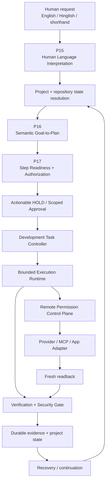
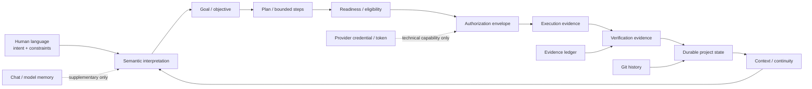
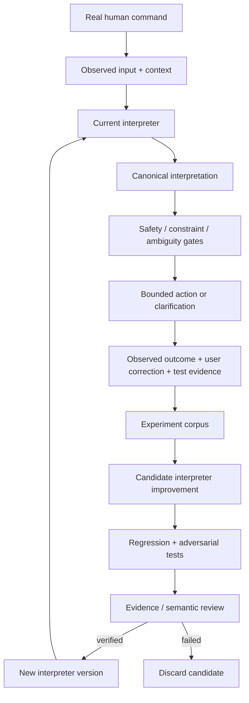
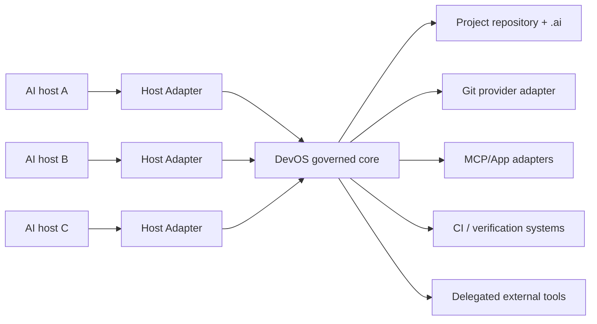

# DevOS Master Engineering Map

> Living architecture, history, future flow, semantic model, portability target, and self-evolution rules for the Development OS.
>
> **Audience:** AI engineers, coding agents, maintainers, and fresh AI/account/platform handoffs.
>
> **Status:** living design document. Verified repository facts, engineering goals, and unproven future targets are intentionally distinguished.

## 1. The objective

DevOS is a repository-first Development OS for AI-assisted software engineering.

The objective is not to build one autonomous coding bot tied to one vendor. The objective is to make software-development context, governance, planning, execution boundaries, verification, recovery, and engineering knowledge portable across AI models/vendors, AI accounts/chats, coding agents/MCP hosts, machines, Git providers, provider adapters, and multiple concurrently managed projects.

```text
AI A + Account A
      ↓
   Repository
      ↓
AI B + Account B
      ↓
Correct state recovery
      ↓
Safe continuation
```

The repository carries project truth. Chat memory is supplementary context, never the project authority.

## 2. Core engineering law

DevOS completion is:

```text
IMPLEMENTED + VERIFIED + DOCUMENTED
```

The system deliberately separates:

```text
INTERPRETATION != AUTHORIZATION
PLAN != EXECUTION
READY != EXECUTION
CI PASS != AUTHORIZATION
PROVIDER CREDENTIAL != DEVOS AUTHORIZATION
SIMULATED EVIDENCE != LIVE PROVIDER PROOF
PROVIDER RESPONSE != COMPLETION PROOF
RECOVERY != AUTOMATIC MUTATION REPLAY
```

This is why DevOS can become more autonomous without turning the AI into an unrestricted operator.

## 3. What has been built so far

P0–P7 established the foundational project-context, evidence, security, bounded-autonomy, runtime, portability, and onboarding substrate. The repository subsequently closed:

```text
P9   Development Task Controller
P10  Context Continuity & Recovery
P11  Federation & Self-Healing Context
P12  Operational Intelligence
P13  Autonomous Development Orchestration
P14  Adaptive Verification & Self-Healing
P15  Human Language Interpretation v2
P16  Semantic Goal-to-Plan Compiler
P17  Step Readiness & Authorization Orchestrator
```

Later unnumbered objectives strengthened evidence and remote governance:

```text
Production E2E Harness
Failure + Recovery Proof
Multi-Session / Fresh-AI Continuation Proof
Controlled Remote Mutation Proof
Production-Readiness Evidence Matrix
Trust-First audit / adversarial security proof
Foundation Health / Doctor
Universal Project Onboarding + Repository Creation
Cross-Host Recovery Friction / Health integration
Host-neutral MCP/App repository.create
Current-Source Evidence Refresh
MCP/App Permission Control Plane + Multi-Project Agent Isolation
Actionable HOLD + Scoped Approval + governed continuation (PR #23; merged)
```

These labels are architecture history, not a command to invent endless numbered phases.

## 4. Current governed development flow



The flow is a governed loop, not a single linear script. Every continuation re-enters current state and current gates. Old plans, approvals, checkpoints, or successful runs cannot silently manufacture permission.

## 5. Semantic architecture model



| Layer | Meaning | May it grant authority? |
|---|---|---|
| Human language | What the user is asking | No |
| P15 interpretation | Canonical intent, constraints, ambiguity | No |
| P16 plan | How the objective could be accomplished | No |
| P17 readiness | Whether the exact step is currently eligible | No |
| Authorization | Explicit permission for an exact bounded action | Yes, only within stated scope |
| Runtime | What actually happened | No |
| Verification | What can be proven after the action | No |
| Repository/.ai | Durable project truth and provenance | No, it stores evidence/decisions rather than creating permission |
| Provider credential | Technical ability offered by a provider | No |

## 6. Human Language Interpreter: evolution target

P15 must evolve by **evidence-driven experimentation**, not by silently rewriting authority rules.

Current role: convert natural human requests into bounded semantic intent across contextual English/Hinglish, shorthand, corrections, referents, negative constraints, ambiguity, and safe intent composition.

Future target: improve typo/noise tolerance, short conversational commands, context/referent resolution, temporal phrases, project-aware vocabulary, domain engineering language, multilingual/mixed-language input, clarification selection, hidden scope expansion detection, and learning from accepted/rejected interpretations without learning new authority.



> **The interpreter may learn how to understand language better; it may not learn that language itself grants permission.**

Every persistent experiment belongs in the repository with input/context, baseline/candidate output, semantic delta, risk analysis, regression evidence, decision, and source commit.

## 7. Any-account / any-AI / any-platform target



A compatible AI host should be able to discover the project, recover `.ai` + Git state, inspect source/current HEAD, interpret language through P15, compile bounded plans through P16, obtain P17 readiness and exact authorization, execute only through supported runtime/adapters, verify actual results, persist evidence/semantic state, and recover safely in a fresh session or on another host.

## 8. Future automated-development flow

```text
Human objective
   ↓
Repository bootstrap / identity
   ↓
Current-state recovery
   ↓
P15 semantic interpretation
   ↓
P16 bounded plan
   ↓
P17 exact-step readiness
   ↓
Scoped approval / security evidence
   ↓
Controller
   ↓
Bounded runtime + adapters
   ↓
Fresh verification / readback
   ↓
Durable evidence + semantic documentation
   ↓
Regression / CI
   ↓
CONTINUE | HOLD | STOP | ESCALATE
```

Larger objectives may be decomposed into independent work units, but each unit preserves project identity, scope, dependencies, authorization, evidence, and verification.

## 9. Self-maintaining repository model

The repository should continuously stay **machine-current** and **semantically explicit**.

Automation may safely update exact source heads, Git/CI observations, changelogs, evidence references, generated indexes, timestamps/run metadata, and bounded health diagnostics.

AI/engineering judgment is required for architecture, decisions, requirements, objectives, future plans, experiment conclusions, and semantic security/authorization changes. Automation must not infer semantic truth from commit messages alone.

```text
material code / contract change
        ↓
affected durable record identified
        ↓
implementation
        ↓
verification
        ↓
documentation / state update
        ↓
CI / review
```

## 10. Future goals

**G1 — Universal project recovery.** Fresh AI/account/machine recovers the correct project state from repository evidence without chat-history dependency.

**G2 — Universal host adapter.** Any compatible AI host connects through the same governed semantic/runtime contracts.

**G3 — Provider-neutral remote operations.** Provider adapters expose capability while DevOS remains the authority boundary for exact actions.

**G4 — Safe long-running engineering agent.** Long objectives work across many sessions with checkpoints, recovery, scoped continuation, and no-blind-replay semantics.

**G5 — Evidence-native development.** Important claims trace to source, tests, CI, runtime evidence, or clearly marked deterministic simulation.

**G6 — Self-improving human-language interface.** P15 improves from experiment/evidence while authorization rules remain invariant.

**G7 — Multi-project isolation.** A long-lived agent can work on many projects without cross-project state, approval, credential, or context leakage.

**G8 — Automated engineering lifecycle.** Mature DevOS supports inspect → plan → implement → verify → document → continue across supported stacks, escalating when human authority is still required.

**G9 — Production evidence, not production claims.** Production readiness is a measured evidence outcome, not a prose label.

## 11. Deliberately outside automatic authority

Even a future highly autonomous DevOS must separately gate destructive deletion, force updates, production deployments, permission/credential/secret changes, destructive database changes, security-policy weakening, account/identity changes, and irreversible external side effects.

More autonomy means better planning, recovery, verification, and tool coordination—not weaker authorization.

## 12. Fresh-AI continuation protocol

```text
1. Read AGENTS.md.
2. Read .ai/manifest.yaml.
3. Read .ai/CURRENT-STATE.md.
4. Read .ai/TASKS.md.
5. Read .ai/DECISIONS.md.
6. Read this master engineering map.
7. Inspect Git HEAD and working tree.
8. Inspect applicable CI / evidence.
9. Reconcile conflicts using repository-first precedence.
10. Identify the active bounded objective.
11. Rebuild the current plan rather than trusting stale chat instructions.
12. Continue only through P15/P16/P17/controller/runtime gates.
13. Persist what changed and what was proven.
```

## 13. How this document stays alive

This map is a durable **navigation/design layer**, not a competing source of truth.

Maintenance contract: `core/devos-living-state-and-evolution.md`.

Interpreter experiment ledger: `docs/DEVOS-INTERPRETER-EXPERIMENT-LEDGER.md`.

Stable fresh-AI discovery: `docs/handoff/README.md`.

When architecture materially changes, update the map, affected semantic records, and evidence references before declaring the change complete.

## 14. Final product direction

```text
Vendor-neutral engineering OS
+ portable project memory
+ semantic human-language interface
+ bounded planning
+ exact readiness / authorization
+ controlled execution
+ evidence-first verification
+ multi-project isolation
+ adaptive recovery
+ experiment-driven language evolution
+ automatic factual synchronization
+ durable future roadmap
= continuously developable AI engineering platform
```
